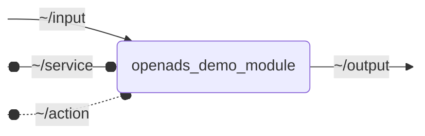

# `openads_demo_module`

ROS 2 C++ package template for OpenADS

## Nodes

### `openads_demo_module`

#### Subscribed Topics

| Topic | Type | Description |
| --- | --- | --- |
| `~/input` | `perception_msgs/msg/EgoData` | Demo input |

#### Published Topics

| Topic | Type | Description |
| --- | --- | --- |
| `~/output` | `perception_msgs/msg/EgoData` | Demo output |

#### Service Servers

| Service | Type | Description |
| --- | --- | --- |
| `~/service` | `std_srvs/srv/SetBool` | Demo service |

#### Action Servers

| Action | Type | Description |
| --- | --- | --- |
| `~/action` | `openads_demo_module_interfaces/action/Fibonacci` | Demo action |

#### Parameters

| Parameter | Type | Default | Description |
| --- | --- | --- | --- |
| `param` | `float` | `1.0` | Demo parameter |
| `diagnostic_updater.topic_diagnostic.min_frequency` | `float` | - | Minimum frequency for incoming messages |
| `diagnostic_updater.topic_diagnostic.max_frequency` | `float` | - | Maximum frequency for incoming messages |
| `diagnostic_updater.topic_diagnostic.min_acceptable_timestamp_delta` | `float` | - | Minimum acceptable timestamp delta for incoming messages |
| `diagnostic_updater.topic_diagnostic.max_acceptable_timestamp_delta` | `float` | - | Maximum acceptable timestamp delta for incoming messages |
| `diagnostic_updater.diagnosed_publisher.min_frequency` | `float` | - | Minimum frequency for outgoing messages |
| `diagnostic_updater.diagnosed_publisher.max_frequency` | `float` | - | Maximum frequency for outgoing messages |
| `diagnostic_updater.diagnosed_publisher.min_acceptable_timestamp_delta` | `float` | - | Minimum acceptable timestamp delta for outgoing messages |
| `diagnostic_updater.diagnosed_publisher.max_acceptable_timestamp_delta` | `float` | - | Maximum acceptable timestamp delta for outgoing messages |

## Launch Files

### [`openads_demo_module_launch.py`](launch/openads_demo_module_launch.py)

| Argument | Default | Description |
| --- | --- | --- |
| `input_topic` | `"~/input"` | Demo input topic |
| `output_topic` | `"~/output"` | Demo output topic |
| `service_topic` | `"~/service"` | Demo service |
| `name` | `"openads_demo_module"` | node name |
| `namespace` | `""` | node namespace |
| `params` | `os.path.join(get_package_share_directory("openads_demo_module"), "config", "params.yml")` | path to parameter file |
| `log_level` | `"info"` | ROS logging level (debug, info, warn, error, fatal) |
| `use_sim_time` | `"false"` | use simulation clock |
